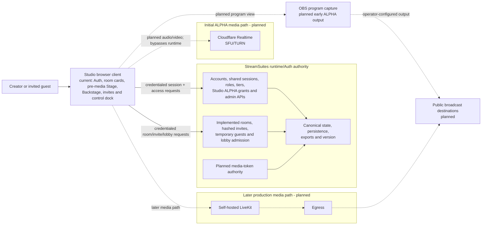

# StreamSuites Studio system architecture

## Status

This document separates the implemented session/access/room authority foundation from planned media work. Lines marked planned must not be interpreted as working integration.

## Authority and media paths

## Non-negotiable boundaries

- Studio is a browser client and never becomes a source of canonical account, access, room, invite, permission, token, alert, audit, or version state.
- StreamSuites Runtime/Auth owns those decisions and their persistence.
- Existing admin, creator, developer, and public account types are reused; no Studio-only account authority is introduced.
- Admins are Studio-eligible automatically. Non-admin eligibility comes from an enabled grant keyed to the stable account ID, with a transactional maximum of 25 enabled invited grants. Grants never change role, tier, creator capability, or public-profile state.
- `GET /api/studio/access` re-evaluates live session/account/grant truth and fails closed. Admin management is provided by `GET`/`POST /api/admin/studio/access` and `PATCH`/`DELETE /api/admin/studio/access/{account_id}` using existing admin authorization, audit, and alert-event seams.
- Guest access is implemented as a temporary room-scoped identity granted through Runtime/Auth-validated invitation links. Raw invite codes and guest credentials are never stored; only secure hashes persist.
- The separate `streamsuites_studio_guest` HttpOnly cookie lasts up to 12 hours, never overwrites `streamsuites_session`, uses shared secure production scope, and follows the existing host-only local/private development policy.
- Room lifecycle is `draft`, `open`, `closed`, and final `ended`. Owner/admin controls and `BEGIN IMMEDIATE` admission transactions enforce no more than nine admitted guest occupants while leaving lobby waiting capacity separate; the host/director is outside the guest cap.
- Runtime/Auth may authorize and mint media access, but the Python runtime does not carry audio or video packets.
- Cloudflare Realtime is the initial planned SFU/TURN media layer.
- Self-hosted LiveKit plus Egress is the later planned production media path, not the current implementation.
- Public viewers are broadcast-destination audiences and are not placed in Studio WebRTC rooms.
- No provider API detail is assumed until its contract is verified in the implementation phase that needs it.

## Current frontend integration

- `src/config/env.ts` accepts a public Runtime/Auth override, with established production/local fallbacks, plus the optional runtime-version URL.
- `src/api/studioAuth.ts` validates Auth/access plus room, invite, guest-session, and lobby contracts, always sends credentials, supports cancellation, and normalizes machine-readable errors.
- `/login` uses existing Runtime/Auth OAuth and email/password paths with a validated same-origin return target. It separately consumes `GET /auth/access-state` and `POST /auth/debug/unlock`; the latter issues Runtime's short-lived signed HttpOnly bypass cookie and never substitutes for Turnstile. `/studio` renders no authorized shell until access is confirmed, `/studio/rooms/:roomId` is owner/admin protected, and `/join/:inviteCode` remains available to temporary guests. Logout uses `POST /auth/logout`.
- The room dashboard, pre-media room workspace, and guest join flow hold fetched server state only in React memory. The one-time raw invite disappears on reload/navigation; no room, lobby, invite, guest token, or guest credential is persisted or logged by Studio.
- `/studio` presents Runtime room summaries as Enter-room-first cards. `/studio/rooms/:roomId` renders the Stage/Program canvas and Backstage together on desktop, with responsive panels for Backstage, invites, and confirmed room settings. Admit, deny, remove, invite, lifecycle, and room-detail mutations use the existing adapter and then refetch authoritative Runtime state.
- Grid, Interview, Spotlight, selected-participant, open-panel, and explanatory-dialog state is presentation-only component memory. It is not sent to Runtime, persisted, or described as a live broadcast layout.
- The production dock keeps microphone, camera, and screen sharing disabled, while `OFF AIR`, inactive `00:00:00`, and the Go live explanation explicitly state that media/output integration is unavailable. No permission prompt or media API is used.
- No canonical auth/access state, Turnstile token, bypass code, or bypass flag is saved to browser storage. The bypass response expiry and Turnstile completion live only in component memory; the authoritative bypass is Runtime's HttpOnly cookie. `streamsuites_studio_theme` is the only new local preference.
- Turnstile script/config loading is shared, one render generation owns the visible widget, and normal auth/access/form rerenders cannot recreate it. The shell loading bar uses reference-counted transient UI activity and does not participate in the widget lifecycle.
- The authenticated topbar menu renders only safe session fields already returned by Runtime/Auth and delegates logout to `POST /auth/logout`; no Studio-owned account destination or session copy is introduced.
- `src/api/runtimeVersion.ts` validates the existing runtime-owned `version.json` shape but does not hydrate the UI until a Studio-safe deployed URL is confirmed.
- `src/domain/studio.ts` contains confirmed normalized session/access, room, invite, and guest view models plus media direction models. These client view models are not backend schemas.

## Theme and brand

- Dark is the first-visit default; light mode is token-driven across all routes and reusable components.
- The accessible header switch persists only the theme choice and an early head script applies it before React/CSS render.
- Headers use the existing `assets/logos/sscmattesilver.webp` asset in both modes.
- The document favicon is `/assets/icons/studiofavicon.ico`; OAuth buttons import the committed `assets/icons/google.svg`, `github.svg`, `discord.svg`, `x.svg`, and `twitch.svg` files so Vite fingerprints and emits real production-build asset URLs. The files match Public's working provider assets.

## Early ALPHA output

Before server-side egress exists, the approved direction is a dedicated browser program view that OBS can capture. That view, its clean-feed behavior, and any destination configuration remain future work.
