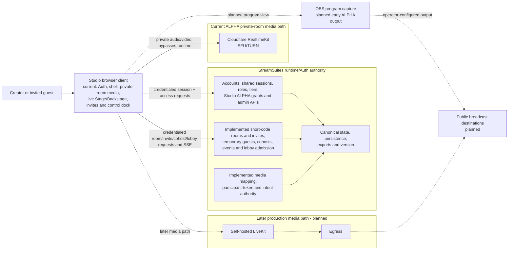

# StreamSuites Studio system architecture

## Status

This document separates implemented private-room RealtimeKit media from planned output/broadcast infrastructure. Lines marked planned must not be interpreted as working integration.

## Authority and media paths

## Non-negotiable boundaries

- Studio is a browser client and never becomes a source of canonical account, access, room, invite, permission, token, alert, audit, or version state.
- StreamSuites Runtime/Auth owns those decisions and their persistence.
- Existing admin, creator, developer, and public account types are reused; no Studio-only account authority is introduced.
- Admins are Studio-eligible automatically. Non-admin eligibility comes from an enabled grant keyed to the stable account ID, with a transactional maximum of 25 enabled invited grants. Grants never change role, tier, creator capability, or public-profile state.
- `GET /api/studio/access` re-evaluates live session/account/grant truth and fails closed. Admin management is provided by `GET`/`POST /api/admin/studio/access` and `PATCH`/`DELETE /api/admin/studio/access/{account_id}` using existing admin authorization, audit, and alert-event seams.
- Guest access is implemented as a temporary room-scoped identity granted through Runtime/Auth-validated short invitation links. Guests may join without an account. After embedded password/OAuth completion, Studio refreshes the same route and Runtime alone derives the account link from the shared session cookie; no client account ID proves identity. Untouched account name/CDN-avatar fields hydrate the room form, explicit draft edits win, and room overrides never mutate the account. Canonical invite codes are context-separated HMAC derivatives that Runtime/Auth can regenerate for authorized copying; only hashes are indexed and guest credentials remain hash-only.
- Room events are persisted with monotonic IDs before an in-process signal wakes credentialed SSE streams. Studio treats every event as an invalidation hint, coalesces refetches, and polls only while SSE is disconnected.
- Session cohosts are room/guest scoped and expire with that authority. Permanent cohost relationships require an authenticated invited account and remain separately scoped to all director rooms or selected internal room IDs; neither path changes roles, tiers, ownership, grants, billing, or public profiles.
- The separate `streamsuites_studio_guest` HttpOnly cookie lasts up to 12 hours, never overwrites `streamsuites_session`, uses shared secure production scope, and follows the existing host-only local/private development policy.
- Room lifecycle is `draft`, `open`, `closed`, and final `ended`. Owner/admin controls and `BEGIN IMMEDIATE` admission transactions enforce nine total visible Stage slots: the host/director reserves one and no more than eight additional guests or cohosts may be on Stage. Backstage capacity remains separate, and moving someone Backstage immediately frees one additional Stage slot.
- Runtime/Auth may authorize and mint media access, but the Python runtime does not carry audio or video packets.
- Cloudflare RealtimeKit Core 2.0.0 is the initial ALPHA media transport; Runtime/Auth owns mappings and participant-token issuance while Studio owns the custom media UI.
- Self-hosted LiveKit plus Egress is the later planned production media path, not the current implementation.
- Public viewers are broadcast-destination audiences and are not placed in Studio WebRTC rooms.
- No provider API detail is assumed until its contract is verified in the implementation phase that needs it.

## Current frontend integration

- `src/config/env.ts` accepts a public Runtime/Auth override, with established production/local fallbacks, plus the optional runtime-version URL.
- `src/api/studioAuth.ts` validates Auth/access plus room, invite-policy, guest-profile, cohost, presentation, SSE, and lobby contracts, always sends credentials, supports cancellation, and normalizes machine-readable errors.
- `/login` uses existing Runtime/Auth OAuth and email/password paths with a validated same-origin return target. `/join/:inviteCode` reuses that implementation inside a focus-trapped sheet; safe display name, subtitle, and supported initials color may cross OAuth in a namespaced 15-minute `sessionStorage` draft, while credentials, challenge/bypass values, invite code, avatar bytes, cookies, and authority never do. Password completion refreshes Auth in place and OAuth returns to the exact invite route.
- The room dashboard, media workspace, and guest join flow hold fetched server state only in React memory. No room, lobby, invite code, participant token, guest credential, avatar binary, or cohost authority is persisted or logged by Studio.
- `/studio` presents Runtime room summaries with canonical Room ID chips. `/studio/rooms/:roomId` dispatches to director/cohost management or the current guest's safe Stage/Backstage workspace, canonicalizes old UUID URLs, and exposes only permission-summary-approved participant, ordering, presentation, invite, and cohost actions. Guest joins navigate into this route rather than remaining on a text waiting page.
- The primary left and room-production right sidebars have separate validated local preference keys and separate selected/hover/pinned/hidden state. Both default collapsed; each bottom control changes only its own collapsed/pinned-expanded mode, while View alone hides/restores either system to collapsed. Header, cinematic, and notice-duration preferences retain their compatibility object. These shell modes change layout classes without remounting the room route, RealtimeKit meeting, participant/source elements, or SSE connection. Corrupt fields fall back independently; no room, guest, invite, permission, event, or media value is accepted into display storage.
- Cinematic presentation is active only for the protected room workspace. It retains room identity, lifecycle/broadcast truth, `OFF AIR`, connection state, arrival counts, layouts, and the production dock while promoting the same right contextual Backstage/invite/settings panel and handlers into a focus-managed overlay. It does not create a second lobby store.
- Browser fullscreen is an optional, explicit room action using the standard Fullscreen API. Support and `fullscreenchange` determine the visible state; requests may enable cinematic presentation but do not overwrite saved sidebar/header modes, and rejected requests are reported without claiming success.
- Requested Auto, Grid, Interview, Spotlight, Presentation, and Custom layout plus valid spotlight/presentation participant selection are Runtime-owned and SSE synchronized. Runtime persists `auto`; Studio derives the effective built-in layout from active screen share, explicit spotlight, then one/two/three-to-nine participant count. Runtime also owns at most eight stable-ID custom snapshots per room, each storing a Grid/Interview/Spotlight/Presentation base, name, and order. Creation from Auto submits the currently resolved built-in mode; selection stores requested `custom` separately from the selected layout ID and effective built-in mode. Freeform geometry is not implemented.
- Runtime also owns Fill/Fit camera-slot sizing and presentation participant overlay/outside plus top/bottom/left/right placement. The grid is an explicit centered row model for one through nine cameras. Screen shares are safe stable-ID `screen_share` sources that start Backstage; Stage location is permission-checked and SSE-refetched independently from the existing RealtimeKit track lifecycle. One active provider share is supported, sources do not consume participant slots, and no media traverses Runtime.
- Runtime/Auth also owns stable `browser` sources: safe name, validated URL, Backstage/on-Stage/disabled lifecycle, viewport, refresh/mute/interaction intent, `production_only` or `room` visibility, opacity, revision, and a centered bounded normalized 16:9 rectangle. New sources begin Backstage. Existing room SSE publishes only source ID/state summaries and clients refetch canonical state; restricted URLs and query values are not event data. Browser sources do not consume participant slots, enter RealtimeKit, or cause media/SSE reconnection.
- Studio renders authorized browser URLs only in a focused iframe component. The strict scripts-only sandbox permits no forms, same-origin privilege, popups, downloads, top navigation, media devices, geolocation, clipboard, payment, USB/Bluetooth/MIDI, display capture, or autoplay audio; referrer policy is `no-referrer` and Stage pointer input is off until an authorized operator explicitly enters interaction mode. Runtime never fetches/proxies pages, and Studio does not bypass X-Frame-Options, CSP, authentication, or anti-embedding behavior. Freeform drag/resize, snapping, z-order editing, crop, and rotation remain a separate milestone.
- Runtime owns the room's three-state broadcast participant-label visibility, versioned branding document, and reusable room image records. Studio's Brand and Media tools maintain only reversible drafts until the canonical response arrives, then refetch on safe room SSE events. Branding controls styling only; Room Settings decides whether broadcast labels show. Backstage management, cohost/invite actions, participant menus, and accessibility labels retain identity.
- Room asset management accepts PNG/JPEG/WebP only. Runtime validates declared and decoded type, byte/dimension limits, normalizes to WebP through the generalized guest-avatar image seam, and serializes only exact `https://cdn.streamsuites.app/...` URLs. Asset bytes, base64/data URLs, local paths, arbitrary remote URLs, and management metadata are never exposed to ordinary guests. Assigned-asset deletion requires confirmation and atomically clears branding.
- The active-room desktop has two independent edge-sidebar systems around the Stage. The primary left rail opens dedicated, independently scrolling Studio/Rooms, Brand, Media, Destinations, and Settings panels; the Studio panel uses lobby versus in-room copy/actions and never contains Backstage, invite, cohost, or room-production tools. The right vertical rail exclusively opens dedicated Backstage, Invites, Room/custom-layout, Branding, and Media/browser-source panels. Each collapsed 64px rail temporarily reveals its adjacent approximately 360px panel as an absolute overlay on hover/focus; pinning reserves the combined rail/panel width, and View-only hiding releases only that side. The rejected compressed horizontal top-level room-tab strip and its edge scrollers are removed. The centered Stage retains size-container 16:9 fitting between whatever widths are actually pinned, with no document-level horizontal overflow.
- Stage media components keep stable participant keys inside a centered 16:9 output sized by both the live Stage container width and height. The viewport-owned room region accounts for shell grid rows, the compact room header, the 76px dock, and actual gaps; Backstage follows below in normal page overflow and cannot shrink the primary Stage. Exactly two visible participants fill equal full-height columns; usable camera video hides the central fallback while the independently styled/visible name/subtitle overlay remains. Contextual messages are compact absolute overlays with typed tones, manual close, paused timers, and a polite live region; persistent media/connection status remains in the Stage and dock. Presentation keeps the screen at `object-fit: contain`.
- Explicit preflight uses RealtimeKit device APIs and requests permission only after user action. The 2.0.0 client enables `experimentalAudioPlayback`; SDK audio play is allowed only after initialization/join with a present audio manager on the current lifecycle generation. Missing audio and expected autoplay rejection become localized recovery UI, and a replaced meeting cannot receive stale calls. Local/remote video registration, active speaker, screen sharing, Stage synchronization, and guest lifecycle sit beneath the existing workspace. SDK media changes precede Runtime intent updates; `OFF AIR`, inactive `00:00:00`, and disabled Go live remain separate output truth.
- No canonical auth/access state, Turnstile token, bypass code, bypass flag, room/invite/guest/cohost/permission state, browser-source URL, or SSE/media state is saved to browser storage or route/query navigation. The bypass response expiry, Turnstile completion, notice queue, selected sidebar sections, source interaction mode, and temporary hover expansion live only in component memory; the authoritative bypass is Runtime's HttpOnly cookie. Local storage is limited to validated display keys: `streamsuites_studio_theme`, `streamsuites_studio_primary_sidebar`, `streamsuites_studio_room_production_sidebar`, and the compatibility `streamsuites_studio_presentation` object.
- Turnstile script/config loading is shared, one render generation owns the visible widget, and normal auth/access/form rerenders cannot recreate it. The shell loading bar uses reference-counted transient UI activity and does not participate in the widget lifecycle.
- The authenticated topbar menu renders only safe session fields already returned by Runtime/Auth and ports Public's unified avatar/name/allowed-badge chip, one-role-or-tier suppression, dropdown geometry, and keyboard/outside-click/focus behavior. The exact committed Public badge assets remain multicolor images; monochrome workspace controls use the reusable CSS-mask/currentColor renderer and never globally invert assets.
- `src/api/runtimeVersion.ts` validates the existing runtime-owned `version.json` shape. The global footer hydrates the configured export and performs one established `/api/health` check per shell mount, with loading/online/degraded states and no aggressive poll.
- `src/domain/studio.ts` contains confirmed normalized session/access, room, invite, and guest view models plus media direction models. These client view models are not backend schemas.

## Theme and brand

- Dark is the first-visit default; light mode is token-driven across all routes and reusable components.
- The accessible header switch persists only the theme choice and an early head script applies it before React/CSS render.
- Headers use the existing `assets/logos/sscmattesilver.webp` asset in both modes.
- The document favicon is `/assets/icons/studiofavicon.ico`; OAuth buttons import the committed `assets/icons/google.svg`, `github.svg`, `discord.svg`, `x.svg`, and `twitch.svg` files so Vite fingerprints and emits real production-build asset URLs. The files match Public's working provider assets.

## Early ALPHA output

Before server-side egress exists, the approved direction is a dedicated browser program view that OBS can capture. That view, its clean-feed behavior, and any destination configuration remain future work.
