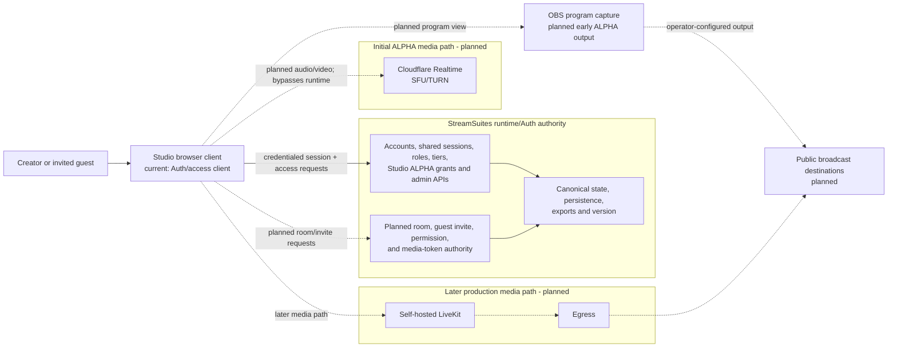

# StreamSuites Studio system architecture

## Status

This document separates the implemented session/access foundation from planned room and media work. Lines marked planned must not be interpreted as working integration.

## Authority and media paths

## Non-negotiable boundaries

- Studio is a browser client and never becomes a source of canonical account, access, room, invite, permission, token, alert, audit, or version state.
- StreamSuites Runtime/Auth owns those decisions and their persistence.
- Existing admin, creator, developer, and public account types are reused; no Studio-only account authority is introduced.
- Admins are Studio-eligible automatically. Non-admin eligibility comes from an enabled grant keyed to the stable account ID, with a transactional maximum of 25 enabled invited grants. Grants never change role, tier, creator capability, or public-profile state.
- `GET /api/studio/access` re-evaluates live session/account/grant truth and fails closed. Admin management is provided by `GET`/`POST /api/admin/studio/access` and `PATCH`/`DELETE /api/admin/studio/access/{account_id}` using existing admin authorization, audit, and alert-event seams.
- Guest access is planned as temporary, room-scoped permission granted through Runtime/Auth-validated invitation links.
- Runtime/Auth may authorize and mint media access, but the Python runtime does not carry audio or video packets.
- Cloudflare Realtime is the initial planned SFU/TURN media layer.
- Self-hosted LiveKit plus Egress is the later planned production media path, not the current implementation.
- Public viewers are broadcast-destination audiences and are not placed in Studio WebRTC rooms.
- No provider API detail is assumed until its contract is verified in the implementation phase that needs it.

## Current frontend integration

- `src/config/env.ts` accepts a public Runtime/Auth override, with established production/local fallbacks, plus the optional runtime-version URL.
- `src/api/studioAuth.ts` validates `GET /auth/session` and `GET /api/studio/access`, sends credentials, normalizes errors, and exposes loading, unauthenticated, allowed, denied, restricted, and unavailable states.
- `/login` uses existing Runtime/Auth OAuth and email/password paths with a validated same-origin return target. `/studio` renders no authorized shell until access is confirmed. Logout uses `POST /auth/logout`.
- No canonical auth/access state is saved to browser storage. `streamsuites_studio_theme` is the only new local preference.
- `src/api/runtimeVersion.ts` validates the existing runtime-owned `version.json` shape but does not hydrate the UI until a Studio-safe deployed URL is confirmed.
- `src/domain/studio.ts` contains confirmed normalized session/access view models plus provisional room, guest-invite, and media direction models. These are not backend schemas.

## Theme and brand

- Dark is the first-visit default; light mode is token-driven across all routes and reusable components.
- The accessible header switch persists only the theme choice and an early head script applies it before React/CSS render.
- Headers use the existing `assets/logos/sscmattesilver.webp` asset in both modes.

## Early ALPHA output

Before server-side egress exists, the approved direction is a dedicated browser program view that OBS can capture. That view, its clean-feed behavior, and any destination configuration remain future work.
