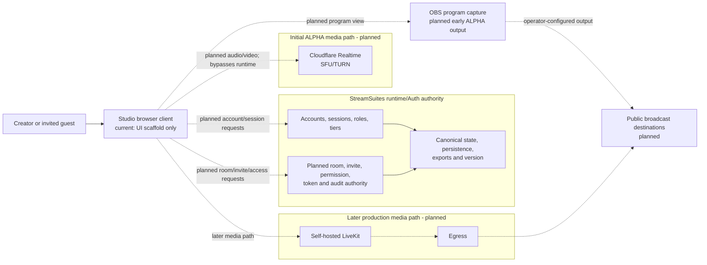

# StreamSuites Studio system architecture

## Status

This document describes the approved direction. Only the Studio browser scaffold exists in this repository today. Lines marked planned must not be interpreted as working integration.

## Authority and media paths

## Non-negotiable boundaries

- Studio is a browser client and never becomes a source of canonical account, access, room, invite, permission, token, alert, audit, or version state.
- StreamSuites Runtime/Auth owns those decisions and their persistence.
- Existing admin, creator, and public account types are reused; no Studio-only account authority is introduced.
- Guest access is planned as temporary, room-scoped permission granted through Runtime/Auth-validated invitation links.
- Runtime/Auth may authorize and mint media access, but the Python runtime does not carry audio or video packets.
- Cloudflare Realtime is the initial planned SFU/TURN media layer.
- Self-hosted LiveKit plus Egress is the later planned production media path, not the current implementation.
- Public viewers are broadcast-destination audiences and are not placed in Studio WebRTC rooms.
- No provider API detail is assumed until its contract is verified in the implementation phase that needs it.

## Current frontend seams

- `src/config/env.ts` accepts optional public Runtime/Auth and runtime-version URLs.
- `src/api/contracts.ts` records the confirmed `GET /auth/session` request path while deliberately treating its payload as unknown pending adapter work.
- `src/api/runtimeVersion.ts` validates the existing runtime-owned `version.json` shape but does not hydrate the UI until a Studio-safe deployed URL is confirmed.
- `src/domain/studio.ts` contains provisional view models for access, room summaries, guest invites, and media direction. These are not backend schemas.

## Early ALPHA output

Before server-side egress exists, the approved direction is a dedicated browser program view that OBS can capture. That view, its clean-feed behavior, and any destination configuration remain future work.
